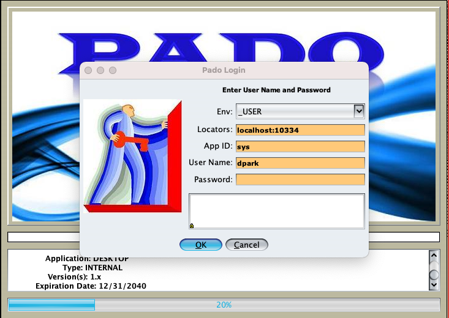
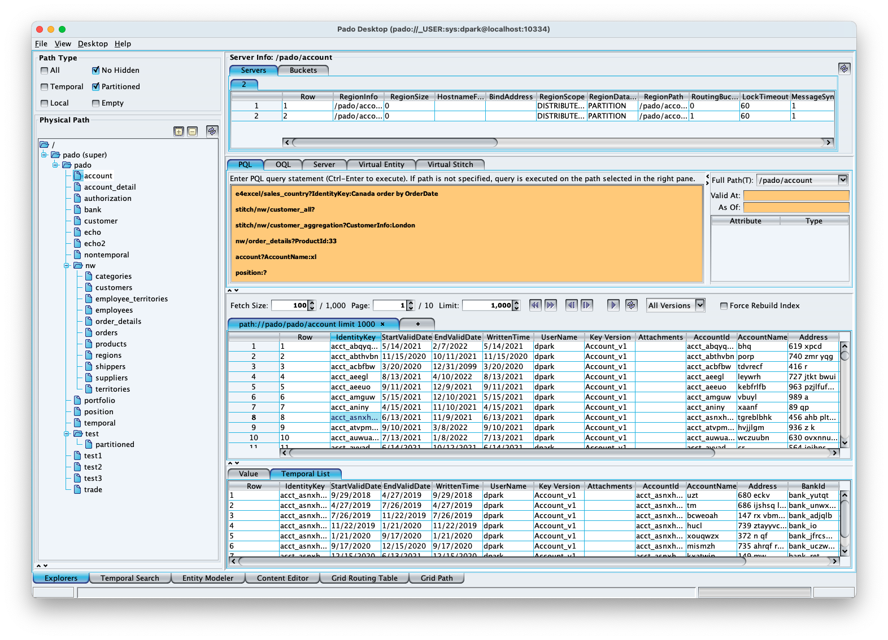

# Geode/GemFire PadoDesktop App

The `padodesktop` app provides scripts to run PadoDeskop for monitoring Pado clusters and executing PQL (Pado Query Language) and Geode/GemFire OQL (Object Query Language).

## Installing PadoDesktop App

PadoDesktop requires a Pado cluster. Pado can be installed by running the `install_padogrid` and `update_products` commands.

```bash
install_padogrid -product pado
update_padogrid -product pado 
```

Similary, PadoDesktop can be installed using the `install_padgrod` and `update_products` commands as follows.

```bash
install_padogrid -product padodesktop
update_products -product padodesktop
```

The following commands create a Pado cluster and a PadoDesktop app.

```bash
create_cluster -cluster mypado -type pado
create_app -product geode -app padodesktop
```

## Running PadoDesktop App

The `bin_sh` directory contains the PadoDesktop scripts as follows.

```console
bin_sh/
├── clean
├── desktop
├── encryptor
├── pado_env.sh
└── setenv.sh
```

To start PadoDesktop:

```bash
cd_app padodesktop/bin_sh
./destop
```

From the login prompt, enter the Pado locator(s) and any user name. Password is not required.



Upon successful login, the desktop should display as shown below.



The `encryptor` command is for encrypting or decrypting text that may be added in the Pado client configuration files found in the `etc/` directory.

The desktop collects log and stats files in the `log/` and `stats` directories, respetively. The `clean` script empties these directories.

```bash
./clean
```

## References

1. Pado, [https://github.com/netcrest/pado](https://github.com/netcrest/pado).
